# LAB2 实验报告

## problem1：**理解** **first-fit** 连续物理内存分配算法

###### first-fit 连续物理内存分配算法作为物理内存分配一个很基础的方法，需要同学们理解它的实现过程。请大家仔细阅读实验手册的教程并结合kern/mm/default_pmm.c 中的相关代码，认真分析 default_init，default_init_memmap，default_alloc_pages，default_free_pages 等相关函数，并描述程序在进行物理内存分配的过程以及各个函数的作用。请在实验报告中简要说明你的设计实现过程。请回答如下问题：你的 first fit 算法是否有进一步的改进空间？

##### first-fit 连续物理内存分配算法（最先匹配算法）

核心思想是：
First Fit是一种动态分区分配算法，它在内存管理中用于分配内存空间给进程。
这种算法的基本原理是：在进行内存分配时，从空闲分区链首开始顺序查找，直到找到第一个足够大的空闲分区来满足内存请求。如果找到的空闲分区比所需内存大，则将该分区分割成两部分，一部分正好满足请求的大小并分配给请求进程，剩下的部分仍然作为空闲分区保留在空闲分区链中。如果空闲分区正好与请求的大小相等，则整个分区被分配给进程，不再保留。
- 优点：高址部分的大的空闲分区得到保留，为大作业的内存分配创造了条件；算法相对简单，易于实现。
- 缺点：每次都是优先利用低址部分的空闲分区，造成低址部分产生大量的外碎片；每次都是从低址部分开始查找，使得查找空闲分区的开销增大；可能会造成大量小碎片，浪费内存空间；容易产生外部碎片，降低了内存的利用率。

##### 具体实现过程为：

- **初始化物理内存管理器**：首先，调用 default_init() 函数来初始化物理内存管理器，将free_list链表初始化为空链表，表示初始状态下没有空闲的内存块可供分配；将nr_free变量初始化为0，表示初始状态下没有空闲内存块可用。
 
  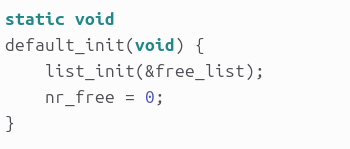

- **初始化内存映射**：初始化内存块，设置它们的属性、引用计数以及标记为空闲。然后，根据链表的情况，将这些内存块插入到 free_list 中，以便后续的内存分配可以使用这些空闲内存块。
  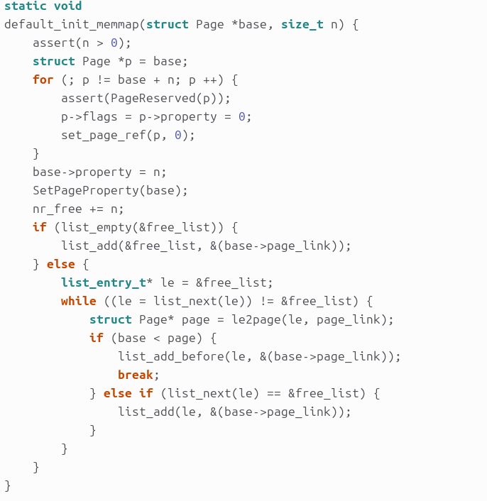
- **分配内存**：调用 default_alloc_pages() 函数。该函数会遍历物理内存映射表，寻找第一个满足大小要求的连续页框，然后将其标记为已分配，并返回指向该页框的指针。
  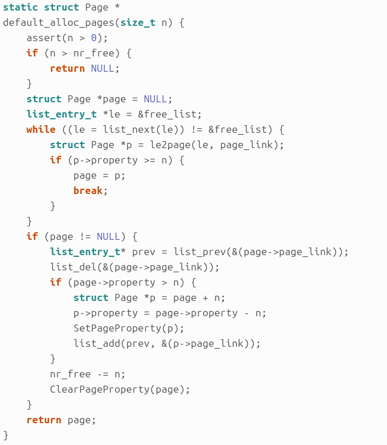
- **释放内存**：调用 default_free_pages() 函数。该函数将释放的页框重新插入空闲内存块链表中，标记为可用，以便它们可以被后续的分配操作使用,图片部分展示。
  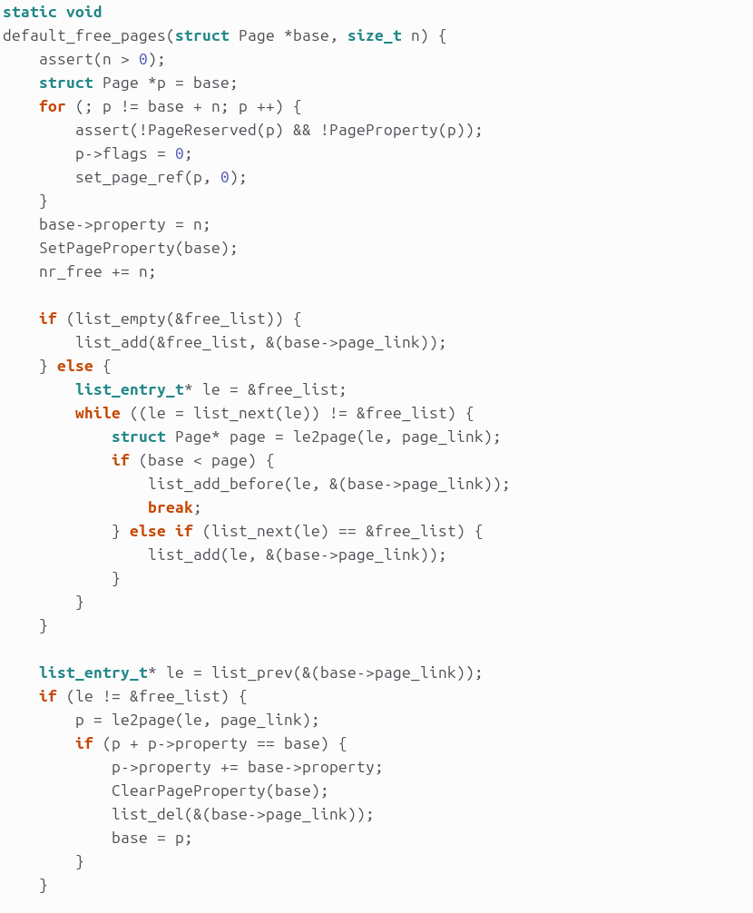
- **检查物理内存管理器**：调用basic_check()对其基本功能进行检查，在default_check中对其分配和释放等功能进行检查，以确保内存管理器的正常运行

##### 进一步改进策略：

解决内存碎片、效率低、内存大小匹配缺乏优化等问题

- **循环首次适应（Next Fit）**：这是first_fit算法的一个变种，它不是每次都从链表的头部开始查找，而是从上一次找到的空闲分区的下一个分区开始查找，直到找到可以为该进程分配内存的空闲分区。这种方法可以使内存中的空闲分区分布更加均匀，减少查找时的系统开销，但仍然可能存在低地址部分碎片较多的问题.

- **首次适应递减（First Fit Decreasing, FFD）**：这种策略是first_fit算法的另一种变种，它在首次适应的基础上，将请求按照大小进行降序排序，然后使用首次适应算法进行分配。这种方法可以使得大的空闲分区更有可能被利用，从而减少大的空闲分区被分割成小分区的情况.

- **内存紧缩（Memory Compaction）**：通过移动内存中的进程，将所有的空闲空间集中在一起，形成一个大的连续空闲区域。这种方法可以减少外部碎片，但需要较大的计算开销，并且可能会影响正在运行的进程.

- **使用数据结构优化**：通过使用更高效的数据结构（如平衡树、哈希表等）来存储空闲分区信息，可以提高查找空闲分区的速度，从而提高算法的整体性能。

- **结合其他算法**：可以将first_fit算法与其他算法（如best_fit算法或worst_fit算法）结合使用，以利用各种算法的优点，提高内存分配的效率和效果。

- **动态调整策略**：根据系统的运行情况动态调整内存分配策略，例如，在系统空闲时进行内存紧缩，或者在大作业频繁到达时切换到最坏适应算法以保留大的空闲分区。

以上改进的方法可以更高效、灵活的应对内存分配问题，提高内存分配效率和内存利用率。

## problem2：实现 Best-Fit 连续物理内存分配算法

###### 在完成练习一后，参考 kern/mm/default_pmm.c 对 First Fit 算法的实现，编程实现 Best Fit 页面分配算法，算法的时空复杂度不做要求，能通过测试即可。请在实验报告中简要说明你的设计实现过程，阐述代码是如何对物理内存进行分配和释放，并回答如下问题：你的 Best-Fit 算法是否有进一步的改进空间？

##### best-fit连续物理内存分配算法

核心思想是：
Best Fit是一种动态内存分配策略，其核心思想是在所有足够大的空闲内存块中选择一个最小的空闲块来满足内存分配请求。这种方法可以最大限度地减少内存碎片，提高内存的利用率。

##### 该算法的具体实现过程：

- ##### best_fit_pmm.c文件中实现best-fit算法细节：

  - best_fit_init（）：这个函数与first-fit算法相同，这里不再重复说明。

  - best_fit_init_memmap（）：初始化一块连续的物理内存，并将其添至空闲内存链表中。标记空闲内存块的起始页、数量和属性，将这些内存块升序排列插入到free_list中，以便后续的内存分配可以使用这些空闲内存块。

    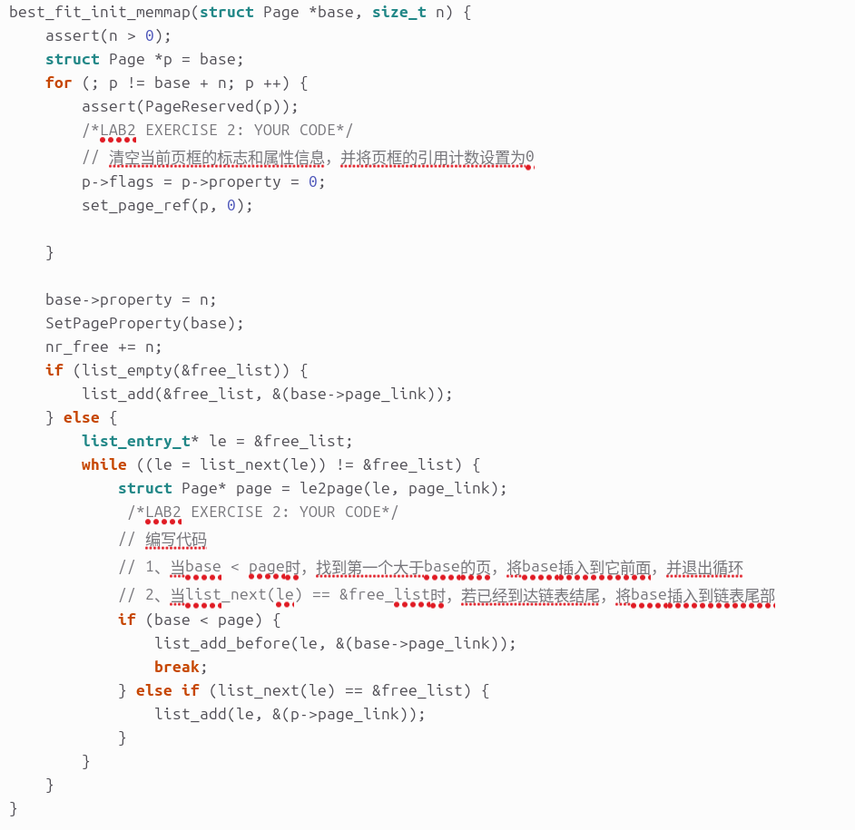

  - best_fit_alloc_pages（）：这个函数用于内存分配，此处的逻辑不同于 first-fit 的找到第一个满足需求的就进行分配，而是找到满足分配的最小内存块，所以在寻找 page时的循环中将 if
    分支的判断条件改为 if (p->property >= n && p->property < min_size) ，并且维护了
    size_t min_size ，将其初始化为 nr_free + 1 ，且每次找到更合适的 page时进行更新

    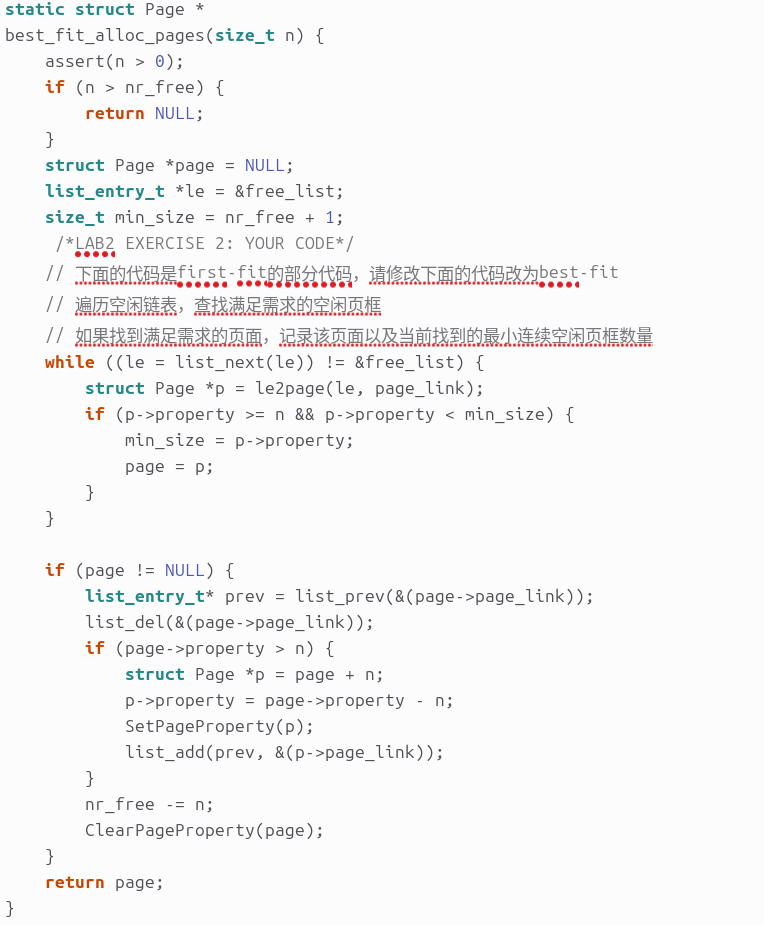

  - best_fit_free_pages（）:
  best_fit_nr_free_pages()&basic_check()&best_fit_check():这几部分函数与first-fit算法相同，不再进行赘述。

    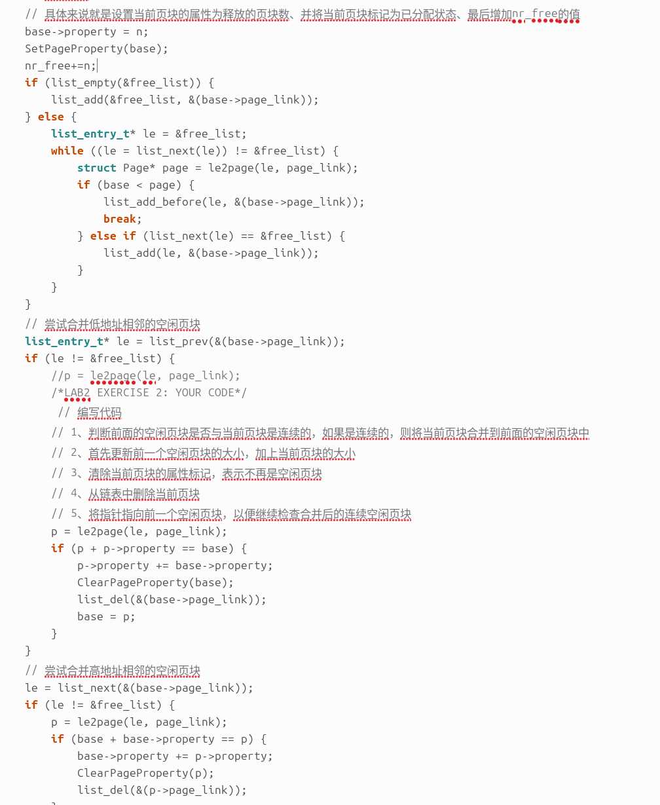
    

  - 最后，在pmm.c文件中，将init_pmm_manager()函数下的内存管理器更改为best_fit_pmm_manager（即将first-fit算法改为best-fit算法进行内存的分配和释放）

    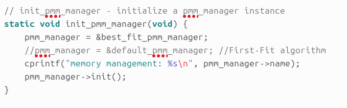

  ##### 结果测试：

    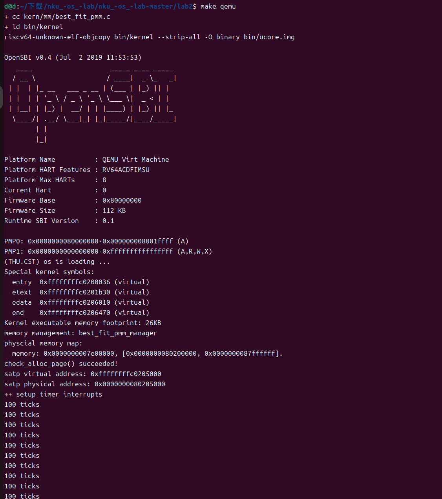

##### 进一步改进策略：

主要解决过度的碎片化、资源浪费、巨大的时间开销问题

- **优化数据结构**：使用更高效的数据结构来存储空闲内存块的信息，例如使用平衡树或哈希表，以减少查找最佳适应块的时间复杂度。

- **空间整理**：定期或在特定条件下对内存进行整理，合并相邻的空闲块，以减少外部碎片，这可以通过内存紧缩或合并空闲块来实现。

- **组合策略**：将最佳适应算法与其他算法（如首次适应或最坏适应）结合使用，以利用各种算法的优点，提高内存分配的效率和效果。

- **动态调整**：根据系统的运行情况动态调整内存分配策略，例如，在系统空闲时进行内存紧缩，或者在大作业频繁到达时切换到最坏适应算法以保留大的空闲分区。

- **头优先分配**：在内存分配时，保持空闲内存区域在内存的顶部，这样可以在分配和释放内存时减少查找空闲块的时间，从而提高效率。这种策略在某些实现中可以使内存分配和释放过程大约加快34.86%，同时保持外部碎片最小

- **使用Bitmaps或Free Lists**：使用Bitmaps或Free Lists来管理空闲内存，可以提高内存查找效率。Bitmaps通过为每个页面帧设置一位来表示页面帧是空闲还是已分配，而Free Lists则通过链接列表来维护空闲内存块

- **减少内存分配开销**：通过减少内存分配算法的开销，例如减少分配过程中的比较次数，或者通过缓存最近使用的空闲块来加快分配速度。

- **内存分配算法的并行化**：在多处理器系统中，可以通过并行化内存分配算法来提高内存分配的效率。

- **自适应算法**：开发自适应的内存分配算法，根据系统的当前状态和历史分配模式动态选择最佳的内存分配策略。

## challenge 1：buddy system（伙伴系统）分配算法

###### Buddy System 算法把系统中的可用存储空间划分为存储块 (Block) 来进行管理, 每个存储块的大小必须是 2 的n 次幂 (Pow(2, n)), 即 1, 2, 4, 8, 16, 32, 64, 128…参考伙伴分配器的一个极简实现，在 ucore 中实现 buddy system 分配算法，要求有比较充分的测试用例说明实现的正确性，需要有设计文档。

首先，介绍Buddy System分配算法的基本原理：

- **内存分割**：在伙伴系统中，内存被分割成固定大小的块，这些块的大小通常是2的幂（例如2KB、4KB、8KB等）。每个块可以被看作是二叉树中的一个节点，树的叶子节点代表最小的可用块 

- **内存分配**：当进程请求内存时，系统会寻找能够容纳请求大小的最小可用块。如果找到的块比请求的尺寸大，系统会将该块分割成两个等大小的“伙伴”块，然后将其中一个块标记为已分配，并将其添加到进程的内存分配表中。另一个块则返回到空闲内存池中，并重新链接到二叉树结构中 

- **内存释放**：当进程释放内存时，系统会将相应的块标记为空闲，并寻找其伙伴块。如果伙伴块也是空闲的，系统会将两个块合并成一个更大的块，并将其链接回二叉树结构中 

接下来，介绍`buddy_system_pmm.c`文件的实现.

 **`buddy_system_init_memmap`函数**：初始化伙伴系统的内存映射，设定初始的物理内存块以及初始化相应的伙伴系统数据结构。

	- 基本检查和初始化后，循环遍历初始化内存块。对于每个物理页，将其标志和属性初始化，包括清除保留标志、设置引用数为0，以及设置页的属性。
	- 设置基址和长度信息，将 `base` 的属性设置为 `n`，并设置 `base0` 为当前基址。计算适用于伙伴系统的长度 `length`，长度为2的幂次方。
	- 初始化buddy system的数据结构。根据长度 `length`，设置每个块的大小。如果当前位置是2的幂次方，将块大小减半，用以适应伙伴系统的数据结构。这里的 `buddy` 数组记录了每个块的大小。

  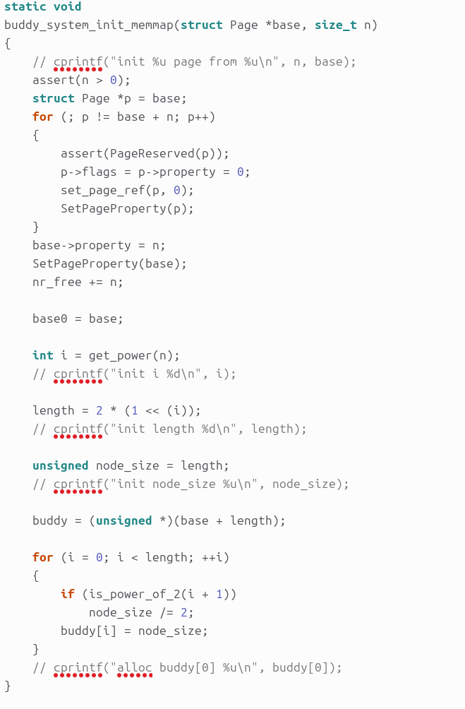

**`buddy_system_alloc_pages`函数**：实现伙伴系统的页面分配逻辑。

- 确定分配的页数，如果 `n` 小于等于0，将其设置为1。如果 `n` 不是2的幂次方，则找到大于等于 `n` 的最小的2的幂次方。
- 初始化索引 `index`，以及节点大小和偏移量。循环找到合适的位置，分配块的大小。在每次循环中，检查当前节点的左子节点和右子节点的大小（buddy system的特性，每个节点的子节点大小是它的一半）。如果左子节点的大小大于等于需要分配的页数 `n`，则选择左子节点，否则选择右子节点。
- 更新页信息和返回结果，更新空闲页数和清除属性。
  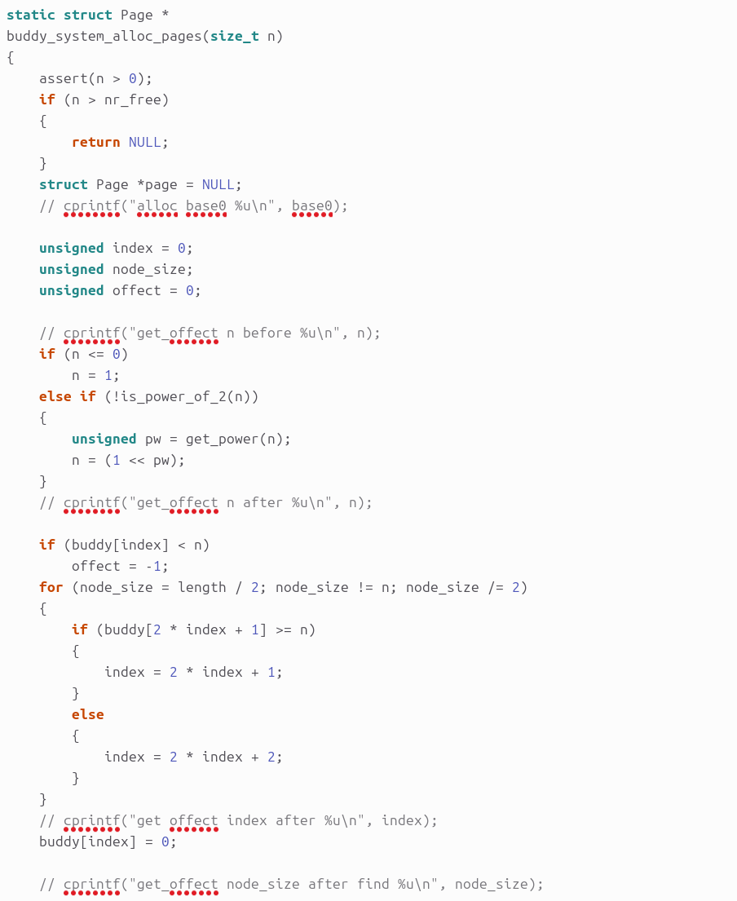
**`buddy_system_free_pages`函数**：实现了在buddy system中释放指定数量的页面的逻辑。目的是将释放页面后可能产生的连续的空闲节点进行合并，确保buddy system的内存管理始终正确。
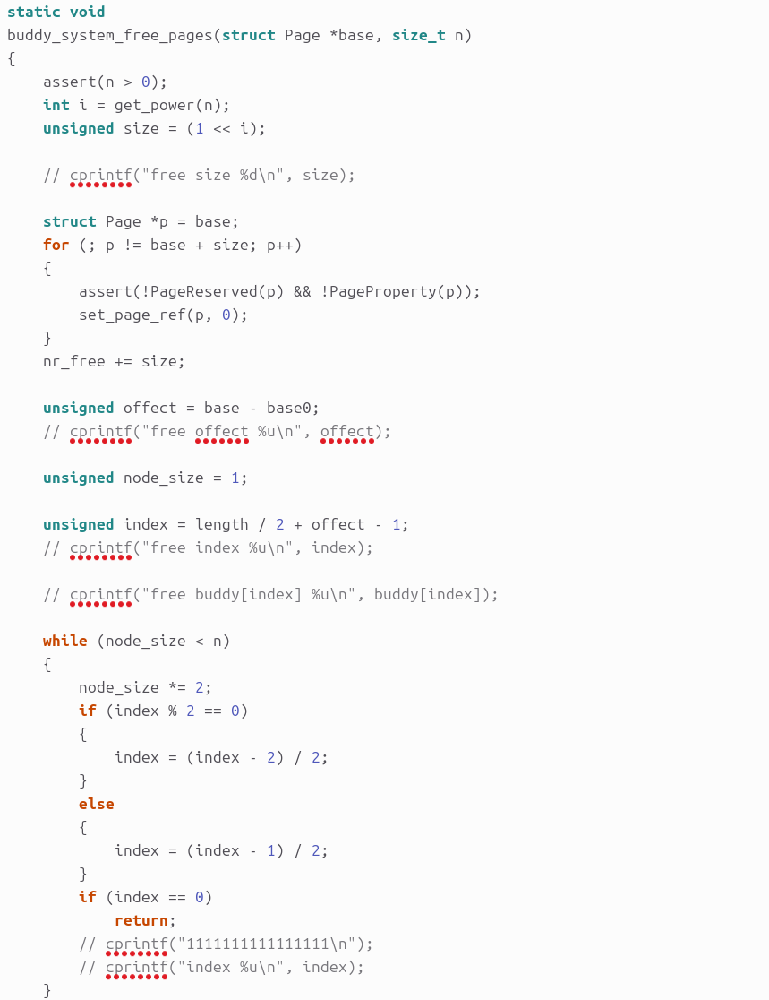

**`buddy_check`函数**：用于检验buddy system的分配与释放是否符合预期。进行多页的内存分配，分别为 `p0`、`p1`、`A`、`B`、`C` 分配不同数量的页面。验证分配的页面之间的关系，如相邻页面的位置关系和分配是否符合伙伴系统算法的规则。释放一些页面，再分配页面，验证释放和分配后内存合并的正确性。

## challenge 2：**任意大小的内存单元** **slub** 分配算法

###### slub 算法，实现两层架构的高效内存单元分配，第一层是基于页大小的内存分配，第二层是在第一层基础上实现基于任意大小的内存分配。可简化实现，能够体现其主体思想即可。参考linux 的 slub 分配算法/，在 ucore 中实现 slub 分配算法。要求有比较充分的测试用例说明实现的正确性，需要有设计文档。

SLUB算法的主要特点包括：
- **简化的实现**：SLUB算法的实现比SLAB更为简单，减少了代码的复杂性，从而降低了出错的可能性

- **调试支持**：SLUB默认包含了完整的调试功能，但这些功能默认是关闭的。可以通过内核命令行参数slub_debug启用调试，以便于发现和解决内存管理中的问题

- **对象跟踪**：SLUB可以跟踪内存对象的分配和释放，这有助于检测内存泄漏和其他内存相关的问题
- **内存合并**：在没有启用调试选项的情况下，SLUB可能会合并类似的slab以减少开销并提高对象的缓存热度
- **内存验证**：如果内核启动时启用了slub_debug，SLUB可以验证所有对象的正确性。即使在没有启用调试的情况下，也可以对可达对象进行有限的验证
- **性能优化**：SLUB通过调整slab的分配顺序来优化性能，减少了对中心资源（如列表锁）的依赖，从而减少了潜在的竞争

- **紧急操作**：即使在没有启用调试的情况下，SLUB也能保持系统运行，通过最少的调试（仅一致性检查）来启用SLUB的弹性特性
- **扩展的slabinfo模式**：SLUB提供了slabinfo工具，它可以查询slab的状态，控制反碎片和对象回收，运行验证通过slab缓存，并在运行时调整slab缓存

## challenge 3：硬件的可用物理内存范围的获取方法

###### 如果 OS 无法提前知道当前硬件的可用物理内存范围，请问你有何办法让 OS 获取可用物理内存范围？

在操作系统无法提前知道硬件的可用物理内存范围时，可以通过一些硬件级别的机制或通过启动时的BIOS信息获取可用物理内存范围。

- **BIOS中断调用**：在系统启动时，BIOS提供了中断调用，通过这些中断可以获取内存信息。例如，BIOS中断0x15的子功能0xE820可以遍历主机上全部内存，获取系统的内存布局。每次BIOS只返回一种类型的内存信息，直到全部返回完成。内存信息被存在一个结构中--地址范围描述符ARDS。这种方法可以在操作系统启动早期，即在保护模式设置之前使用。

- **GRUB获取内存分布**：在使用GRUB启动的系统中，GRUB将内存的分布放到了multiboot_t结构体里。这个结构体包含了内存的分布信息，包括可用内存的地址和长度。操作系统可以在启动时从这个结构体中获取内存信息。

- **/proc/buddyinfo**：在Linux系统中，可以通过/proc/buddyinfo文件查看Buddy系统管理的内存块的分配情况。这个文件提供了内存页的分配和使用情况的详细信息，包括每个内存区（zone）的总页数、已用页数、空闲页数等。虽然这个文件不直接提供可用物理内存的范围，但它可以帮助操作系统了解内存的使用情况。

- **内存映射**：操作系统可以使用内存映射（Memory Mapping）技术来获取物理内存的布局。通过映射，操作系统可以访问物理内存地址，从而获取内存信息。

- **ACPI（Advanced Configuration and Power Interface）**：现代计算机使用ACPI来配置硬件并提供系统级信息，包括内存映射。操作系统可以通过ACPI表来获取内存布局信息。

- **内核空间的内存管理机制**：Linux内核使用伙伴系统（Buddy System）算法来管理物理内存的分配和回收。虽然这不是为了获取内存范围，但通过内核的内存管理机制，操作系统可以了解内存的使用情况，并据此推断出可用的物理内存范围。

