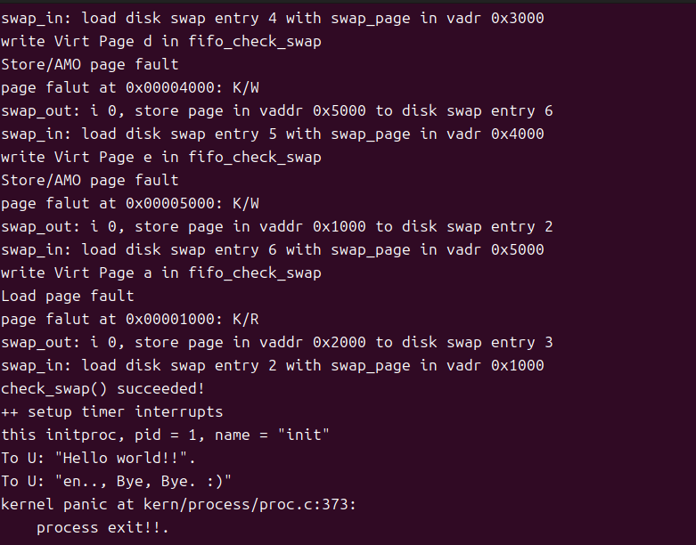

# Lab4 实验报告

###  2211581-庞艾语 2212824-刘星宇 2212481-董圣娇

### 练习1：分配并初始化一个进程控制块（需要编码）

###### alloc_proc函数（位于kern/process/proc.c中）负责分配并返回一个新的struct proc_struct结构，用于存储新建立的内核线程的管理信息。ucore需要对这个结构进行最基本的初始化，你需要完成这个初始化过程。

> 【提示】在alloc_proc函数的实现中，需要初始化的proc_struct结构中的成员变量至少包括：state/pid/runs/kstack/need_resched/parent/mm/context/tf/cr3/flags/name。

对这个结构进行最基本的初始化编写代码如下：

```C
proc->state = PROC_UNINIT;
proc->pid = -1;
proc->runs = 0;
proc->kstack = 0;
proc->need_resched = 0;
proc->parent = NULL;
proc->mm = NULL;
memset(&(proc->context), 0, sizeof(struct context));
proc->tf = NULL;
proc->cr3 = boot_cr3;
proc->flags = 0;
memset(proc->name, 0, PROC_NAME_LEN);
```

- **state:** 进程状态（共有四种：PROC_UNINIT、PROC_SLEEPING、PROC_RUNNABLE、PROC_ZOMBIE），初始化为 PROC_UNINIT ，表示进程未初始化状态。

- **pid:** 进程ID，初始化为-1，表示尚未分配PID。

- **runs:** 进程的运行次数，初始化为0，表示进程尚未开始运行。

- **kstack:** 进程的内核栈地址，初始化为0，记录了分配给该进程/线程的内核栈的位置。

- **need_resched:** 用于表示进程是否需要重新调度，初始化为0，表示不需要重新调度。

- **parent:** 保存了进程的父进程的指针，初始化为NULL。

- **mm:** 指向进程内存管理结构（struct mm_struct）的指针，保存了内存管理的信息，包括内存映射，虚存管理等内容，初始化为NULL，表示进程尚未拥有地址空间。

- **context:** 保存了进程执行的上下文——关键寄存器的值，使用memset将其所有字段初始化为0。

- **tf**: 指向中断帧（struct trapframe）的指针，初始化为NULL。

- **cr3:** 存储进程的页目录表基址，初始化为ucore启动时建立好的内核虚拟空间的页目录表首地址boot_cr3 （在 kern/mm/pmm.c 的 pmm_init 函数中初始化）

- **flags:** 进程标志位，初始化为0。

- **name:** 进程名称，使用memset将其所有字符初始化为0。

###### 请说明proc_struct中`struct context context`和`struct trapframe *tf`成员变量含义和在本实验中的作用是啥？

- **struct context context** ：

**含义**：用于在进程切换的过程中保存这一进程的上下文，具体而言就是保存创建进程时父进程的部分寄存器值由

**作用**：在进行进程切换时，需要保存当前进程的执行状态，以便稍后能够正确地恢复到该进程。`struct context` 通常包括用于保存寄存器值的字段，以及其他与上下文相关的信息。在进程切换时，先保存当前进程的上下文，然后恢复下一个进程的上下文，实现进程的切换。

- **struct trapframe *tf** ：

**含义**：中断帧的指针，总是指向内核栈的某个位置：当进程从用户空间跳到内核空间时，中断帧记录了进程在被中断前的状态，trapframe还保存了其他信息（错误编号、虚拟地址） 比context多保存了一些信息。当内核需要跳回用户空间时，需要调整中断帧以恢复让进程继续执行的各寄存器值。

**作用**：在系统执行中，当发生异常或中断时，处理器会将当前的寄存器状态保存在一个称为 `trapframe` 的结构中。这包括处理器寄存器、栈指针、指令指针等。将 `struct trapframe` 保存在 `struct proc_struct` 中，使得内核可以在异常处理或中断服务例程中访问和修改这些状态。这也方便了在进程切换时保存和恢复处理器状态。

### 练习2：**为新创建的内核线程分配资源（需要编码）**

###### 创建一个内核线程需要分配和设置好很多资源。`kernel_thread`函数通过调用**do_fork**函数完成具体内核线程的创建工作。`do_kernel`函数会调用`alloc_proc`函数来分配并初始化一个进程控制块,`alloc_proc`只是找到了一小块内存用以记录进程的必要信息，并没有实际分配这些资源。ucore一般通过`do_fork`实际创建新的内核线程。`do_fork`的作用是，创建当前内核线程的一个副本，它们的执行上下文、代码、数据都一样，但是存储位置不同。因此，我们**实际需要****"fork"****的东西就是****stack****和****trapframe**。在这个过程中，需要给新内核线程分配资源，并且复制原进程的状态。你需要完成在kern/process/proc.c中的do_fork函数中的处理过程。它的大致执行步骤包括：

- ###### 调用alloc_proc，首先获得一块用户信息块。

- ###### 分配并初始化内核栈（setup_stack函数）

- ###### 根据clone_flags决定是复制还是共享内存管理系统（copy_mm函数）

- ###### 设置进程的中断帧和上下文（copy_thread函数）

- ###### 把设置好的进程加入链表

- ###### 将新建的进程设为就绪态

- ###### 将返回值设为线程id

填写的`do_fork`函数代码如下：

```c
int do_fork(uint32_t clone_flags, uintptr_t stack, struct trapframe *tf) {
    int ret = -E_NO_FREE_PROC;
    struct proc_struct *proc;
    if (nr_process >= MAX_PROCESS) {//检查是否有足够的进程空间
        goto fork_out;
    }
    ret = -E_NO_MEM;    //分配新的进程结构体
    // 分配并初始化进程控制块（alloc_proc函数）
    proc = alloc_proc();
    if (proc == NULL) {
    goto fork_out;//分配失败,退出
}
    proc->parent = current;    
    // 分配并初始化内核栈（setup_stack函数）  
    ret = setup_kstack(proc);  
   if (ret !=0) {
    goto bad_fork_cleanup_kstack;//若分配失败，跳转到清理内核栈的代码
}
    //    根据clone_flags决定是复制还是共享内存管理系统 
   ret = copy_mm(clone_flags, proc);
if (ret !=0) {
    goto bad_fork_cleanup_kstack;
}
    //设置进程的中断帧和上下文,,trapframe 存储了进程的寄存器状态，用于上下文切换。
    copy_thread(proc, stack, tf);
    //   把设置好的进程加入链表 
   bool intr_flag;
    local_intr_save(intr_flag);
    {
        proc->pid = get_pid(); //设置返回码为子进程的id号
        hash_proc(proc);
        list_add(&proc_list, &(proc->list_link));
        nr_process ++;
    }
    //  将新建的进程设为就绪态  
    wakeup_proc(proc);
   // 将返回值设为线程id
     ret = proc->pid;
fork_out:
    return ret;
bad_fork_cleanup_kstack:
    put_kstack(proc);
bad_fork_cleanup_proc:
    kfree(proc);
    goto fork_out;
}
```

###### 请说明ucore是否做到给每个新fork的线程一个唯一的id？

可以做到。
```c
   proc->pid = get_pid(); //设置返回码为子进程的id号
```
get_pid 函数用于获取一个唯一的进程ID (PID)，其目的是确保为每个进程分配一个唯一且有效的 PID。我们通过分析该函数的实现可以看出，如何保证每次分配的 PID 是唯一的。
#### `get_pid` 函数解析

##### 1. PID 范围和循环条件
- **`MAX_PID` 和 `MAX_PROCESS`:**
  - `MAX_PID` 是系统允许的最大进程ID。
  - `MAX_PROCESS` 是系统中最大可容纳的进程数。
  - `static_assert(MAX_PID > MAX_PROCESS)` 这行代码的作用是检查 `MAX_PID` 是否大于 `MAX_PROCESS`，如果条件不满足则在编译时触发错误。这可以确保 `PID` 数量足够大，足以容纳所有进程。

##### 2. PID 分配和唯一性
- **`last_pid` 和 `next_safe`:**
  - `last_pid` 追踪上次分配的 `PID`。每次调用 `get_pid`，`last_pid` 会加 1，直到达到 `MAX_PID` 为止。
  - **`next_safe`** 用于记录下一次可用的 PID。
  - 这些值用于生成下一个 `PID`，并且通过比较现有进程的 `PID` 来确保新 `PID` 的唯一性。

##### 3. PID 分配流程
- **`if (++last_pid >= MAX_PID):`**
  - 该条件保证了当 `last_pid` 达到 `MAX_PID` 时会重新从 `1` 开始分配 `PID`，从而防止 `PID` 达到上限时发生溢出。

- **`repeat` 和 `next_safe:`**
  - 当 `last_pid` 等于当前 `next_safe` 时（也就是发现该 `PID` 已经被使用），它会增加 `last_pid`，并在循环中继续寻找下一个未使用的 `PID`。
  - **`next_safe = MAX_PID` 和 `next_safe = proc->pid:`** 如果当前 `PID` 被占用，那么 `next_safe` 会更新为更大的值。`next_safe` 用于追踪下一个没有被占用的 `PID`，避免重复分配。

##### 4. 检查 PID 唯一性
- **检查现有 PID 是否已存在:**
  - `while ((le = list_next(le)) != list)` 循环遍历 `proc_list`，这是所有已存在进程的列表。每次都要确保新分配的 `PID` 不会与当前已存在的 `PID` 重复。
  - `if (proc->pid == last_pid)` 如果发现已有进程的 `PID` 与 `last_pid` 相同，表示该 `PID` 已经被使用，需要跳过该 `PID`，并重新分配。

- **更新 `next_safe:`**
  - 如果当前 `PID` 小于 `next_safe`（即存在一个更大的空闲 `PID`），`next_safe` 被更新为新的较大值。

##### 5. 最终的 PID 唯一性保证
- **通过循环遍历已分配的 PID 来避免冲突:**
  - 每次生成一个新的 `PID` 时，都会检查现有的进程列表（`proc_list`）中是否已经存在该 `PID`。如果存在，`last_pid` 会增加，直到找到一个空闲的 `PID`。
  - 这样确保了返回的 `PID` 在当前系统中是唯一的。

##### 6. 代码解析

```C
static int
get_pid(void) {
    static_assert(MAX_PID > MAX_PROCESS);
    struct proc_struct *proc;
    list_entry_t *list = &proc_list, *le;
    static int next_safe = MAX_PID, last_pid = MAX_PID;
    if (++ last_pid >= MAX_PID) {
        last_pid = 1;
        goto inside;
    }
    if (last_pid >= next_safe) {
    inside:
        next_safe = MAX_PID;
    repeat:
        le = list;
        while ((le = list_next(le)) != list) {
            proc = le2proc(le, list_link);
            if (proc->pid == last_pid) {
                if (++ last_pid >= next_safe) {
                    if (last_pid >= MAX_PID) {
                        last_pid = 1;
                    }
                    next_safe = MAX_PID;
                    goto repeat;
                }
            }
            else if (proc->pid > last_pid && next_safe > proc->pid) {
                next_safe = proc->pid;
            }
        }
    }
    return last_pid;
}
```


### 练习3:**编写proc_run函数（需要编码）**

- 检查要切换的进程是否与当前正在运行的进程相同，如果相同则不需要切换。
- 禁用中断。你可以使用/kern/sync/sync.h中定义好的宏local_intr_save(x)和local_intr_restore(x)来实现关开中断。
- 切换当前进程为要运行的进程。
- 切换页表，以便使用新进程的地址空间。/libs/riscv.h中提供了lcr3(unsigned int cr3)函数，可实现修改CR3寄存器值的功能。
- 实现上下文切换。/kern/process中已经预先编写好了switch.S，其中定义了switch_to()函数。可实现两个进程的context切换。
- 允许中断。
- 完成代码编写后，编译并运行代码：make qemu

  如果可以得到如 附录A所示的显示内容（仅供参考，不是标准答案输出），则基本正确。
- ##### 回答如下问题：
   在本实验的执行过程中，创建且运行了几个内核线程？


###### 代码实现：
```C
void
proc_run(struct proc_struct *proc) {
    if (proc != current) {
struct proc_struct *prev = current, *next = proc;
          bool intr_flag;
        // 恢复中断
        //  // 禁用中断
        local_intr_save(intr_flag);
        current = proc;
        //   // 切换页表，确保当前进程的地址空间切换到目标进程的地址空间
        lcr3(next->cr3);
         // 执行上下文切换，保存当前进程的状态，切换到目标进程
        switch_to(&(prev->context), &(next->context));
        local_intr_restore(intr_flag);
    }
}
```
###### 实现思路：
- struct proc_struct *prev = current, *next = proc;：
定义两个指针，prev指向当前进程，next指向要切换到的进程。
- bool intr_flag;：
intr_flag用于后面保存中断状态。在进行上下文切换之前，需要保存当前的中断状态，并在切换完成后恢复。
- local_intr_save(intr_flag);：
这个函数调用禁用中断，并保存当前的中断状态到intr_flag变量中。这是为了防止在上下文切换过程中被中断打断。
- current = proc;：
更新全局变量current，使其指向新的进程，即proc指向的进程。
- lcr3(next->cr3);：
lcr3函数调用用于加载页表寄存器CR3。cr3是CPU的一个控制寄存器，用于存储当前进程的页表基地址。这里将next（即proc）的页表基地址加载到CR3寄存器，确保虚拟地址到物理地址的映射是正确的。
- switch_to(&(prev->context), &(next->context));：
switch_to用于执行实际的上下文切换。它保存当前进程（prev）的状态到prev->context中，并从next->context恢复新进程（next）的状态。context结构体包含CPU寄存器的状态，如程序计数器、栈指针等。
- local_intr_restore(intr_flag);：
恢复之前保存的中断状态。如果之前禁用了中断，这里会根据intr_flag的值决定是否重新启用中断。
###### make qemu 结果：

- 与附录显示结果一致。
###### 内核线程创建：
在本实验的执行过程中，一共创建了两个内核线程，分别为：

-  idleproc 内核线程：
idleproc 是系统的第一个内核线程，通常被称为“idle进程”或“idle线程”，它在系统启动时被创建，并在proc_init函数中初始化。
```c
idleproc->pid = 0;
    idleproc->state = PROC_RUNNABLE;
    idleproc->kstack = (uintptr_t)bootstack;
    idleproc->need_resched = 1;
    set_proc_name(idleproc, "idle");
    nr_process ++;

    current = idleproc;
```
- init_main 内核线程：
这是系统的第二个内核线程，它在proc_init函数中通过调用kernel_thread函数创建。本次实验中，这个进程的作用是通过打印“hello world！！”字符串来表明本次实验成功。
```c
int pid = kernel_thread(init_main, "Hello world!!", 0);
```


### Challenge： 说明语句local_intr_save(intr_flag);…local_intr_restore(intr_flag);是如何实现开关中断的？

- 首先在kern/sync/sync.h文件中找到对应的函数定义：

```C
static inline bool __intr_save(void) {
    if (read_csr(sstatus) & SSTATUS_SIE) {
        intr_disable();
        return 1;
    }
    return 0;
}
```
- read_csr(sstatus)& SSTATUS_SIE：函数调用，用于读取RISC-V的 sstatus 寄存器的值,将其与 SSTATUS_SIE 位做与运算。如果为真，意味着中断是使能的，可以进入if语句。
- intr_disable()：这是一个宏或函数，用于禁用中断，即清除 sstatus 寄存器中的 SSTATUS_SIE 位。然后函数将禁用中断并返回 1，表示中断状态已经被改变。否则，返回0，表示中断状态没有被改变。
- ##### 显然，这段代码用于在需要禁用中断的代码段之前保存中断状态，以便之后可以恢复。这是实现临界区保护的一种方式，确保在执行关键操作时不会被中断打断。

```c
static inline void __intr_restore(bool flag) {
    if (flag) {
        intr_enable();
    }
}
```
- if (flag)：这个条件判断用于检查传入的 flag 参数。flag 参数是由__intr_save 函数返回的，表示中断是否被禁用。
- intr_enable()：如果 flag 为真（即中断之前是使能的），则调用 intr_enable 函数来重新让中断使能，取消禁止状态,这一步通过设置 sstatus 寄存器中的 SSTATUS_SIE 位，以允许中断。
-  #####  这个函数通常在临界区代码执行完毕后调用，以确保系统能够及时响应外部事件，如硬件中断等。
```c
#define local_intr_save(x) \
    do {                   \
        x = __intr_save(); \
    } while (0)
#define local_intr_restore(x) __intr_restore(x);
```
- ##### 这两个宏定义用于封装 __intr_save 和 __intr_restore 函数。
- #define local_intr_save(x) ：这个宏接受一个变量 x，，用于存储中断状态。
do { ... } while (0) 是一个常见的宏定义技巧，用于创建一个多语句的宏，同时确保宏在使用时可以像一个表达式一样被使用，并且可以正确地处理宏的返回值。
__intr_save() 函数被调用，并将返回值（一个布尔值，表示中断是否被禁用）赋给变量 x。
- #define local_intr_restore(x)：这个宏也接受一个参数 x，这个参数是之前 local_intr_save 宏保存的中断状态。
__intr_restore(x) 函数被调用，传入的参数 x 用于决定是否需要重新让中断使能。
```c
  bool intr_flag;
        // 保存当前中断状态到 intr_flag 变量，并禁用中断
        local_intr_save(intr_flag);
        ……//切换页表，上下文切换等进程转换代码
        //恢复中断
        local_intr_restore(intr_flag);

```
- ##### 至此，我们就能清楚local_intr_save(intr_flag)语句是通过__intr_save函数实现禁用中断，并利用宏定义，将参数传给了intr_flag 布尔变量，实现了进程切换过程中的中断禁用。
- ##### 以及local_intr_restore(intr_flag)语句是通过__intr_restore函数，根据intr_flag变量保存的中断状态实现中断使能。


