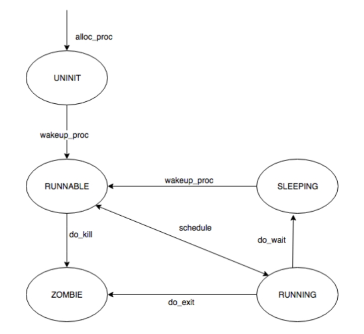

## 操作系统实验lab5

 董圣娇2212481 刘星宇2212824 庞艾语2211581

对实验报告的要求：

- 基于markdown格式来完成，以文本方式为主
- 填写各个基本练习中要求完成的报告内容
- 列出你认为本实验中重要的知识点，以及与对应的OS原理中的知识点，并简要说明你对二者的含义，关系，差异等方面的理解（也可能出现实验中的知识点没有对应的原理知识点）
- 列出你认为OS原理中很重要，但在实验中没有对应上的知识点

## 练习0：填写已有实验

本实验依赖实验2/3/4。请把你做的实验2/3/4的代码填入本实验中代码中有“LAB2”/“LAB3”/“LAB4”的注释相应部分。注意：为了能够正确执行lab5的测试应用程序，可能需对已完成的实验2/3/4的代码进行进一步改进。

- lab4 exercise1 改进的地方：
 
```c
proc->wait_state = 0; //等待状态初始化为0，表示没有等待进程；
proc->cptr =proc->optr=proc->yptr=NULL; //进程间关系指针初始化为空；
``` 
- lab4 exercise2 改进的地方：      
```c
proc->parent = current;
assert(current->wait_state == 0);
```
```c
hash_proc(proc);
set_links(proc);
```

## 练习1: 加载应用程序并执行（需要编码）

do_execv函数调用load_icode（位于kern/process/proc.c中）来加载并解析一个处于内存中的ELF执行文件格式的应用程序。你需要补充load_icode的第6步，建立相应的用户内存空间来放置应用程序的代码段、数据段等，且要设置好proc_struct结构中的成员变量trapframe中的内容，确保在执行此进程后，能够从应用程序设定的起始执行地址开始执行。需设置正确的trapframe内容。

请在实验报告中简要说明你的设计实现过程。

- 请简要描述这个用户态进程被ucore选择占用CPU执行（RUNNING态）到具体执行应用程序第一条指令的整个经过。

### 实现过程

  
根据NOTICE，我们具体补充的代码如下：

```c
 /* LAB5:EXERCISE1 YOUR CODE: 2212481 2212824 2211581
     * should set tf->gpr.sp, tf->epc, tf->status
     * NOTICE: If we set trapframe correctly, then the user level process can return to USER MODE from kernel. So
     *          tf->gpr.sp should be user stack top (the value of sp)
     *          tf->epc should be entry point of user program (the value of sepc)
     *          tf->status should be appropriate for user program (the value of sstatus)
     *          hint: check meaning of SPP, SPIE in SSTATUS, use them by SSTATUS_SPP, SSTATUS_SPIE(defined in risv.h)
     */
    tf->gpr.sp = USTACKTOP;  //设置为用户栈栈顶
    tf->epc = elf->e_entry;  //指示用户程序的入口地址
    tf->status = (read_csr(sstatus) & ~SSTATUS_SPP & ~SSTATUS_SPIE); 
    ret = 0;
```

设计思路如下：

1. `tf->gpr.sp = USTACKTOP;`：用户态进程中，栈指针从高地址向低地址增长，将`sp`的值初始化为栈顶位置，这样用户程序后续在栈上进行操作（如函数调用、局部变量分配等）能在正确的栈空间中进行，可以确保用户程序栈相关操作的正确性。
2. `tf->epc = elf->e_entry;`：`tf->epc`是程序计数器，用于指示下一条要执行的指令地址，`e_entry` 成员则代表着用户程序的入口地址。通过这样的设置，当返回用户态时，处理器就能从用户程序的正确起始位置开始执行，能按照用户程序原本设计的逻辑从入口处启动运行。
3. `tf->status = (read_csr(sstatus) & ~SSTATUS_SPP & ~SSTATUS_SPIE);`：首先，`read_csr(sstatus)` 这个函数调用`read_csr` 读取特定控制状态寄存器 `sstatus `的值,获取了当前处理器的状态寄存器值。然后通过按位与操作（&）结合位取反操作（~），清除了之前所处特权级别的相关位` SSTATUS_SPP`，以设置为用户态对应的状态,以及中断使能`SSTATUS_SPIE`，这里进行清除以符合用户态下的合适设置。这样设置后的 `tf->status `值就能确保处理器切换回用户态时处于合适的状态，保证用户程序可以稳定地在用户态执行下去。


### 用户态进程被选中执行到第一条语句的过程

以下是用户态进程从被 ucore 选择到执行第一条指令的过程：

- 首先，用户态进程由操作系统内核负责创建。具体而言，在内核线程 `initproc `里， `init_main `函数会调用 `kernal_thread` 函数来开启创建一个新进程，并且把 `user_main` 作为参数传入。这一创建操作意味着操作系统要为进程分配其运行所需的各类资源，包括内存空间，用于进程后续存储代码、数据等，同时还会构建其他一些必要的数据结构，用于管理进程自身的各种属性以及执行状态等信息。

- 当进程成功创建后，便处于就绪态，随即被添加到可运行（RUNNABLE）的进程队列之中。

- 在执行 `int pid = kernel_thread(user_main, NULL, 0);` 语句创建出 user 进程之后，会紧接着执行 `do_wait(0, NULL)` 函数。`do_wait` 函数承担着确认是否存在处于 RUNNABLE 状态的子进程这一职责，一旦确认存在，它便会调用 `schedule` 函数来触发调度动作。

- `schedule` 函数在整个进程调度过程中起着关键作用，它会进一步调用 `proc_run` 函数来运行新线程。在 `proc_run` 函数内部，有着一系列为进程顺利执行而准备的关键操作：

  - 加载 userproc 的页目录表。这是因为用户态所使用的页目录表与内核态的页目录表是不同的，所以必须重新进行加载，以此确保进程在后续访问内存时能够基于正确的虚拟地址到物理地址的映射关系来操作，保障内存访问的准确性和合法性。

  - 进行进程上下文的切换操作，这一步骤涉及到将当前 CPU 的执行上下文从之前的进程（内核线程）切换到即将运行的 userproc 进程对应的上下文环境中，完成各种寄存器、程序状态等关键信息的替换与设置。完成这些准备工作后，会跳转到 `forkret` 函数。

- `forkret` 函数接着直接调用 `forkrets` 函数，而 `forkrets` 函数会将栈指针指向 `userproc->tf `的地址，为后续恢复进程执行上下文做好准备，随后跳到 `__trapret` 函数。

- `__trapret` 函数会把` userproc->tf `这个数据结构中所保存的内容依次弹出，并赋值给相应的寄存器，使得 CPU 的各个关键寄存器恢复到该进程之前保存时的状态。之后，通过 `sret` 指令，触发 CPU 跳转到` userproc->tf.epc` 所指向的函数，也就是 `kernel_thread_entry` 函数。

- `kernel_thread_entry` 函数可以看作是额外添加的一层汇编层面的封装，它在执行过程中会继续进行一次跳转，这次跳转会指向 `user_main` 函数。

- 在 `user_main` 函数中，会执行一些初始化相关的操作，比如打印` userproc` 的 `pid `和 `name `等信息，以此来标识该进程的基本情况。随后，它会调用 `kernel_execve` 函数，这一调用将开启与加载执行新应用程序相关的一系列流程。

- 当 `kernel_execve` 执行时，相当于发起了一个 `exec `系统调用。CPU 在检测到这个系统调用请求后，会迅速做出反应，首先保存当前的现场信息，这是为了后续在系统调用结束后能够准确地恢复执行现场，确保进程执行的连贯性。接着，根据系统调用对应的中断号去查找中断向量表，依据查找到的信息进入相应的中断处理例程。经过多个函数之间的一系列跳转与处理，最终会进入到 `exec `系统调用对应的系统处理函数 `do_execve` 中。

- `do_execve` 函数在整个应用程序加载执行过程中有着至关重要的作用，它会执行多项关键操作：

  - 首先，仔细检查虚拟内存空间的合法性，确保即将加载应用程序的内存区域是符合要求、能够正确使用的，避免因内存问题导致后续执行出现错误。

  - 然后，释放之前旧的虚拟内存空间，为加载新的应用程序腾出必要的内存资源，避免内存资源的浪费以及潜在的冲突。

  - 接着，开始加载应用程序，这个过程涉及到诸多细节，比如创建新的 `mm `结构（用于管理进程的内存映射等相关事务）以及与之对应的新的页目录表，以此构建起适合新应用程序运行的内存管理框架。

  - 随后，`do_execve` 函数会调用 `load_icode` 函数，`load_icode` 函数进一步负责将应用程序的各个 `program section`（比如代码段、数据段等不同的程序组成部分）加载到新申请的内存空间之上，同时还会为应用程序中的 `BSS section`（未初始化的全局数据段等）分配相应的内存，并将其初始化为全` 0`，以满足程序执行时对这些数据区域的要求。此外，也会分配用于用户栈的内存空间，用户栈对于程序运行过程中函数调用、局部变量存储等基于栈的操作至关重要。

  - 完成上述内存相关操作后，会设置当前用户进程的 `mm` 结构、页目录表的地址，并且将加载页目录表的地址信息存入 `cr3 `寄存器，以此建立起进程在内存访问方面的完整映射机制。同时，还会对当前用户进程的 `tf` 结构进行相应的设置，为进程后续能够正确地从内核态切换回用户态并执行应用程序做好最后的准备工作。

  - 一切准备就绪后，会返回到 `do_execve` 函数，在这里将当前用户进程的名字设置为`exit`，然后返回。

- 最终，再次通过 `__trapret` 函数，把之前保存在栈上的 `tf` 结构中的内容弹出并赋值给相应的寄存器，使得 CPU 的执行上下文恢复到适合执行应用程序的状态，随后便跳转到 `epc` 指向的函数，也就是应用程序在 `exit.c` 文件中的 `main` 函数，自此开始执行用户程序，进入到应用程序的具体执行流程之中。 

## 练习2: 父进程复制自己的内存空间给子进程（需要编码）

创建子进程的函数do_fork在执行中将拷贝当前进程（即父进程）的用户内存地址空间中的合法内容到新进程中（子进程），完成内存资源的复制。具体是通过copy_range函数（位于kern/mm/pmm.c中）实现的，请补充copy_range的实现，确保能够正确执行。
请在实验报告中简要说明你的设计实现过程。

### 实现过程
copy_range函数的**具体执行流程**:

#### 检查起始和结束地址是否对齐
```c
assert(start % PGSIZE == 0 && end % PGSIZE == 0);
```
内存操作通常以页为单位，因此起始和结束地址必须是页大小的倍数。首先，代码检查起始地址 start 和结束地址 end 是否是页大小对齐的。

#### 检查访问权限
```c
assert(USER_ACCESS(start, end));
```
代码检查用户进程是否有权限访问给定的地址范围 start 到 end。这通常是为了确保操作的地址范围是合法的。

#### 找到父进程指定的某一物理页对应的内核虚拟地址

get_pte 返回父进程在虚拟地址 start 对应的页表项（PTE）。从这个页表项 ptep 中,通过 pte2page(*ptep) 获取父进程的物理页面,完成了获取父进程的物理页地址（通过内核虚拟地址的映射）
```c
pte_t *ptep = get_pte(from, start, 0);
```
并处理 ptep == NULL 的情况，如果 ptep == NULL，表示父进程在虚拟地址 start 上没有有效的页表项，也就是说该虚拟地址没有映射到物理内存。
如果父进程在该虚拟地址没有页表项，代码将调整 start 到下一个有效页的起始地址，并继续循环。
```c
  if (ptep == NULL) {
            start = ROUNDDOWN(start + PTSIZE, PTSIZE);
            continue;
        }
```
### 为子进程分配新的物理页
#### 检查父进程的页表项是否有效。
PTE_V 是一个位标志，表示页表项是否有效（即该页是否已映射到物理内存）。
- 如果不为真，说明该虚拟页没有映射到物理页，不需要进一步处理。
- 如果 *ptep & PTE_V 为真，表示该页是有效的，已经映射到了物理内存。

接着获取子进程的页表项，调用 get_pte 函数来获取子进程（B）在虚拟地址 start 对应的页表项。
这里的 to 是子进程的页目录（页表），start 是当前要处理的虚拟地址，第三个参数 1 表示如果子进程没有对应的页表项，则分配一个新的页表项。

如果 get_pte 返回 NULL，表示分配页表项失败，此时返回 -E_NO_MEM，表示没有足够的内存来分配页表项。
```c
 if (*ptep & PTE_V) {
            if ((nptep = get_pte(to, start, 1)) == NULL) {
                return -E_NO_MEM;
            }}
```
#### 获取权限并分配物理页面
从父进程的页表项 *ptep 中提取权限信息（如用户权限）。PTE_USER 是一个位标志，表示该页是否具有用户权限。perm 变量保存父进程页表项中的用户权限位。

```c
uint32_t perm = (*ptep & PTE_USER);
```
#### 获取父进程的物理页面
page = pte2page(*ptep)：pte2page函数用于将页表项转换为实际的物理页面。通过 *ptep（父进程的页表项），可以得到映射到该页的物理页面结构体 struct Page 指针（page）。
```c
struct Page *page = pte2page(*ptep);
```
#### 为子进程分配新的物理页面

调用 alloc_page 分配一个新的物理页面（npage），用于子进程。这是因为我们需要为子进程分配一个独立的物理页，来存放父进程页面的拷贝。
assert(page != NULL) 和 assert(npage != NULL)检查父进程和子进程的物理页面是否成功分配。如果未成功分配页面，程序会触发断言并中止执行。
```c
struct Page *npage = alloc_page();
assert(page != NULL);
assert(npage != NULL);
```
### 将父进程中的页面内容复制到子进程的物理页面
#### 获取父进程物理页面的内核虚拟地址
初始化一个变量 ret，用来存储函数调用的返回值，通常用于检查操作是否成功。page2kva(page)将物理页面 page 转换为内核虚拟地址（Kernel Virtual Address，KVA）。

- page：父进程的物理页面，通过 pte2page(*ptep) 获得。
- kva_src：该物理页面的内核虚拟地址。通过 page2kva 转换后，可以在内核空间访问该物理页面的数据

#### 获取子进程物理页面的内核虚拟地址
page2kva(npage)：将新分配的物理页面 npage 转换为内核虚拟地址，存储在 kva_dst 中。

- npage：新分配的物理页面，它是为子进程分配的页面。
- kva_dst：这个物理页面在内核空间的虚拟地址，后面会用来将父进程的内容复制到这个物理页面。

####  复制父进程页面内容到子进程的新页面
通过memcpy(kva_dst, kva_src, PGSIZE)：将父进程页面（kva_src）的内容复制到子进程页面（kva_dst）。把父进程的页面内容（如数据、代码等）复制到新分配的子进程页面中。这样，子进程就获得了父进程页面的副本。

- kva_src：父进程物理页面的内核虚拟地址。
- kva_dst：子进程物理页面的内核虚拟地址。
- PGSIZE：页面大小，通常为 4096 字节（4KB），表示复制整个页面的数据。

#### 为子进程建立页表映射
page_insert(to, npage, start, perm)：这个函数将新分配的物理页面 npage 插入到子进程的页表中，并建立虚拟地址 start 和物理地址 npage 的映射。
检查 page_insert 是否成功，如果 page_insert 返回非零值，表示插入页表项时发生了错误，程序会触发断言并中止。这个 assert 用来确保子进程的虚拟地址和物理页面的映射关系成功建立。

代码如下：
```c
  // 获取源页面所在的虚拟地址（注意，此时的PDT是内核状态下的页目表）
void * kva_src=page2kva(page);
// 获取目标页面所在的虚拟地址
void * kva_dst=page2kva(npage);
// 页面数据复制
memcpy(kva_dst,kva_src,PGSIZE);
//将该页面设置至对应的PTE中
ret = page_insert(to, npage, start, perm);
 assert(ret == 0);
```

- 如何设计实现Copy on Write机制？给出概要设计，鼓励给出详细设计。 Copy-on-write（简称COW）的基本概念是指如果有多个使用者对一个资源A（比如内存块）进行读操作，则每个使用者只需获得一个指向同一个资源A的指针，就可以该资源了。若某使用者需要对这个资源A进行写操作，系统会对该资源进行拷贝操作，从而使得该“写操作”使用者获得一个该资源A的“私有”拷贝—资源B，可对资源B进行写操作。该“写操作”使用者对资源B的改变对于其他的使用者而言是不可见的，因为其他使用者看到的还是资源A。

### 概要设计

当一个用户父进程创建自己的子进程时，父进程会把其申请的用户空间设置为只读，子进程可共享父进程占用的用户内存空间中的页面（这就是一个共享的资源）。当其中任何一个进程修改此用户内存空间中的某页面时，ucore会通过page fault异常获知该操作，并完成拷贝内存页面，使得两个进程都有各自的内存页面。这样一个进程所做的修改不会被另外一个进程可见了。

- 在执行do_fork时，子进程的页目录表直接拷贝父进程的页目录表，而不是拷贝内核页目录表；在dup_mmap，只需保留拷贝vma链表的部分，取消调用copy_range来为子进程分配物理内存。
- 将父进程的内存空间对应的所有Page结构的ref均加1，表示子进程也在使用这些内存。
- 将父子进程的页目录表的写权限取消，这样一旦父子进程执行写操作时，就会发生页面访问异常，进入页面访问异常处理函数中，再进行内存拷贝操作，并恢复页目录表的写权限。
### **练习**3：阅读分析源代码，理解进程执行 fork/exec/wait/exit 的实现，以及系统调用的实现（不需要编码）

- ###### 请分析fork/exec/wait/exit的执行流程。重点关注哪些操作是在用户态完成，哪些是在内核态完成？内核态与用户态程序是如何交错执行的？内核态执行结果是如何返回给用户程序的？

- ###### 请给出ucore中一个用户态进程的执行状态生命周期图（包执行状态，执行状态之间的变换关系，以及产生变换的事件或函数调用）。（字符方式画即可）


**分析fork/exec/wait/exit的执行流程**

| **系统调用名** | **含义**                               | **具体完成服务的函数**                                       |
| -------------- | -------------------------------------- | ------------------------------------------------------------ |
| SYS_exit       | process exit                           | do_exit                                                      |
| SYS_fork       | create child process, dup mm           | do_fork->wakeup_proc                                         |
| SYS_wait       | wait process                           | do_wait                                                      |
| SYS_exec       | after fork, process execute a program  | load a program and refresh the mm                            |
| SYS_clone      | create child thread                    | do_fork->wakeup_proc                                         |
| SYS_yield      | process flag itself need resecheduling | proc->need_sched=1, then scheduler will rescheule this process |
| SYS_sleep      | process sleep                          | do_sleep                                                     |
| SYS_kill       | kill process                           | do_kill->proc->flags \|= PF_EXITING->wakeup_proc->do_wait->do_exit |
| SYS_getpid     | get the process's pid                  |                                                              |

一般来说，用户进程只能执行一般的指令，无法执行特权指令。采用**系统调用**机制为用户进程提供一个获得操作系统服务的统一接口层，简化用户进程的实现。

应用程序调用的exit/fork/wait/exec等库函数最终都会调用syscall函数，只是调用的参数不同而已。

##### fork调用过程

**用户态**：fork() -> sys_fork() -> do_fork() -> syscall(SYS_fork) -> ecall

**内核态**：syscall() -> sys_fork() ->do_fork(0, stack, tf)

首先当程序执行fork时，fork使用了系统调用SYS_fork，而系统调用SYS_fork则主要是由do_fork和`wakeup_proc`来完成的。其中，`do_fork`主要完成了以下工作：

1. 分配并初始化进程控制块（ `alloc_proc` 函数）;
2. 分配并初始化内核栈，为内核进程（线程）建立栈空间（ `setup_stack` 函数）;
3. 根据 clone_flag 标志复制或共享进程内存管理结构（ `copy_mm` 函数）;
4. 设置进程在内核（将来也包括用户态）正常运行和调度所需的中断帧和执行上下文 （ `copy_thread` 函数）;
5. 为进程分配一个 PID（ `get_pid` 函数）;
6. 把设置好的进程控制块放入 `hash_list `和 `proc_list` 两个全局进程链表中;
7. 自此，进程已经准备好执行了，把进程状态设置为“就绪”态;
8. 设置返回码为子进程的 PID 号。

而 `wakeup_proc` 函数主要是将进程的状态设置为等待，即 `proc->wait_state = 0`。

##### exec调用过程

**内核态**：kernel_execve() -> ebreak -> syscall() -> sys_exec() -> do_execve()

当应用程序执行的时候，会调用 SYS_exec 系统调用，而当 ucore 收到此系统调用的时候，则会使用 do_execve() 函数来实现，因此这里我们主要介绍 `do_execve() `函数的功能，函数主要时完成用户进程的创建工作，同时使用户进程进入执行。

主要工作如下：

1、首先为加载新的执行码做好用户态内存空间清空准备。如果 mm 不为 NULL，则设置页表为内核空间页表，且进一步判断 mm 的引用计数减 1 后是否为 0，如果为 0，则表明没有进程再需要此进程所占用的内存空间，为此将根据 mm 中的记录，释放进程所占用户空间内存和进程页表本身所占空间。最后把当前进程的 mm 内存管理指针为空。

2、接下来是加载应用程序执行码到当前进程的新创建的用户态虚拟空间中。之后就是调用 load_icode 从而使之准备好执行。

##### wait调用过程

prco_init()` ->`kernel_thread()` -> `init_main()` -> `do_wait()

当执行 wait 功能的时候，会调用系统调用 SYS_wait，而该系统调用的功能则主要由 do_wait 函数实现，主要工作就是父进程如何完成对子进程的最后回收工作，具体的功能实现如下：

1、 如果 pid!=0，表示只找一个进程 id 号为 pid 的退出状态的子进程，否则找任意一个处于退出状态的子进程;

2、 如果此子进程的执行状态不为 `PROC_ZOMBIE`，表明此子进程还没有退出，则当前进程设置执行状态为 `PROC_SLEEPING`（睡眠），睡眠原因为 `WT_CHILD` (即等待子进程退出)，调用 schedule() 函数选择新的进程执行，自己睡眠等待，如果被唤醒，则重复跳回步骤 1 处执行;

3、 如果此子进程的执行状态为 PROC_ZOMBIE，表明此子进程处于退出状态，需要当前进程(即子进程的父进程)完成对子进程的最终回收工作，即首先把子进程控制块从两个进程队列 proc_list 和 hash_list 中删除，并释放子进程的内核堆栈和进程控制块。自此，子进程才彻底地结束了它的执行过程，它所占用的所有资源均已释放。

##### exit调用过程

**内核态**： `kernel_execve()`-> `ebreak` -> `syscall()` -> `sys_exec()` -> `do_execve()` ->`execve_exit` ->`do_exit`

prco_init()` ->`kernel_thread()` -> `init_main()` -> `do_wait()` -> `do_exit

检查当前进程是否是idleproc或initproc，若是则`panic`，获取内存管理结构，减少对内存管理结构的引用计数，如果引用计数降为零，代表没有其他进程共享该内存管理结构，那么清理映射并释放页目录表，最后销毁内存管理结构。最后，将当前进程的 `mm` 指针设置为 `NULL`。将进程的状态设置为 `PROC_ZOMBIE`，表示进程已经退出。如果父进程正在等待子进程退出，则唤醒当前进程的父进程。然后，通过循环处理当前进程的所有子进程，将它们的状态设置为`PROC_ZOMBIE`，并将其重新连接到初始化进程的子进程链表上。如果初始化进程也正在等待子进程退出，那么也唤醒初始化进程。最后，进行调度。


**fork/exec/wait/exit 在实现中是影响进程的执行状态的方式如下：**

- fork 执行完毕后，如果创建新进程成功，则出现两个进程，一个是子进程，一个是父进程。在子进程中，fork 函数返回 0，在父进程中，fork 返回新创建子进程的进程 ID。我们可以通过 fork 返回的值来判断当前进程是子进程还是父进程。fork 不会影响当前进程的执行状态，但是会将子进程的状态标记为 RUNNABLE，使得可以在后续的调度中运行起来；
- exec 完成用户进程的创建工作。首先为加载新的执行码做好用户态内存空间清空准备。接下来的一步是加载应用程序执行码到当前进程的新创建的用户态虚拟空间中。exec 不会影响当前进程的执行状态，但是会修改当前进程中执行的程序；
- wait 是等待任意子进程的结束通知。wait_pid 函数等待进程 id 号为 pid 的子进程结束通知。这两个函数最终访问 sys_wait 系统调用接口让 ucore 来完成对子进程的最后回收工作。wait 系统调用取决于是否存在可以释放资源（ZOMBIE）的子进程，如果有的话不会发生状态的改变，如果没有的话会将当前进程置为 SLEEPING 态，等待执行了 exit 的子进程将其唤醒；
- exit 会把一个退出码 error_code 传递给 ucore，ucore 通过执行内核函数 do_exit 来完成对当前进程的退出处理，主要工作简单地说就是回收当前进程所占的大部分内存资源，并通知父进程完成最后的回收工作。exit 会将当前进程的状态修改为 ZOMBIE 态，并且会将父进程唤醒（修改为RUNNABLE），然后主动让出 CPU 使用权；


#### 给出ucore中一个用户态进程的执行状态生命周期图

>  包括执行状态，执行状态之间的变换关系，以及产生变换的事件或函数调用（字符方式画即可）




## 扩展练习 Challenge 

### 1. 实现 Copy on Write （COW）机制。

###### 给出实现源码,测试用例和设计报告（包括在cow情况下的各种状态转换（类似有限状态自动机）的说明）。这个扩展练习涉及到本实验和上一个实验“虚拟内存管理”。在ucore操作系统中，当一个用户父进程创建自己的子进程时，父进程会把其申请的用户空间设置为只读，子进程可共享父进程占用的用户内存空间中的页面（这就是一个共享的资源）。当其中任何一个进程修改此用户内存空间中的某页面时，ucore会通过page fault异常获知该操作，并完成拷贝内存页面，使得两个进程都有各自的内存页面。这样一个进程所做的修改不会被另外一个进程可见了。请在ucore中实现这样的COW机制。

#### 设置共享标志

将`vmm.c/dup_mmap`函数中的共享变量share的值改为0，启用共享功能：

```c
int dup_mmap(struct mm_struct *to, struct mm_struct *from) {
    ...
        bool share = 0;
    ...
}
```

#### 映射共享页面

在`pmm.c` 中为 `copy_range` 添加对共享的处理，如果 share 为1，那么将子进程的页面映射到父进程的页面。由于两个进程共享一个页面之后，无论任何一个进程修改页面，都会影响另外一个页面，所以需要子进程和父进程对于这个共享页面都保持只读。

```c
int copy_range(pde_t *to, pde_t *from, uintptr_t start, uintptr_t end,
               bool share) {
        ...
        if (*ptep & PTE_V) {
            if ((nptep = get_pte(to, start, 1)) == NULL) return -E_NO_MEM;
            uint32_t perm = (*ptep & PTE_USER);
            //get page from ptep
            struct Page *page = pte2page(*ptep);
            int ret = 0;
            // 如果启用写时复制
            if(share)
            {
                cprintf("Sharing the page 0x%x\n", page2kva(page));
                // 物理页面共享，并设置两个PTE上的标志位为只读
                page_insert(from, page, start, perm & ~PTE_W);
                ret = page_insert(to, page, start, perm & ~PTE_W);
            }
            // 完整拷贝内存
            else
            {
                // alloc a page for process B
                // 目标页面地址
                struct Page *npage = alloc_page();
                assert(page!=NULL);
                assert(npage!=NULL);
                cprintf("alloc a new page 0x%x\n", page2kva(npage));
                void * kva_src = page2kva(page);
                void * kva_dst = page2kva(npage);
                memcpy(kva_dst, kva_src, PGSIZE);
                // 将目标页面地址设置到PTE中
                ret = page_insert(to, npage, start, perm);
            }
            assert(ret == 0);
        }
   ...
}
```

#### 修改时拷贝

如果发生错误的虚拟地址对应的页表项是0，说明该地址没有映射到物理页，那么就需要分配一块物理页，并设置页表项，使得虚拟地址和物理地址能够对应。如果发生错误的虚拟地址对应的页表项不是0，而且是有效的（`PTE_V`位为1），说明该地址已经映射到物理页，但是发生了权限冲突，例如写入了只读页面。这时候就需要进行写时复制（copy-on-write）的操作，即复制一块内存给当前进程，让它拥有自己的物理页，而不是和其他进程共享。如果发生错误的虚拟地址对应的页表项不是0，而且是无效的（`PTE_V`位为0），说明该地址是非法的，那么就需要返回错误信息，并终止进程。

```c
int do_pgfault(struct mm_struct *mm, uint_t error_code, uintptr_t addr) {
    ...
        if (*ptep == 0) {
        // 分配一块物理页，并设置页表项
        if (pgdir_alloc_page(mm->pgdir, addr, perm) == NULL) {
            cprintf("pgdir_alloc_page in do_pgfault failed\n");
            goto failed;
        }
    }
    else {
        struct Page *page=NULL;
        // 如果当前页错误的原因是写入了只读页面
        if (*ptep & PTE_V) {
            // 写时复制：复制一块内存给当前进程
            cprintf("\n\nCOW: ptep 0x%x, pte 0x%x\n",ptep, *ptep);
            // 原先所使用的只读物理页
            page = pte2page(*ptep);
            // 如果该物理页面被多个进程引用
            if(page_ref(page) > 1)
            {
                // 释放当前PTE的引用并分配一个新物理页
                struct Page* newPage = pgdir_alloc_page(mm->pgdir, addr, perm);
                void * kva_src = page2kva(page);
                void * kva_dst = page2kva(newPage);
                // 拷贝数据
                memcpy(kva_dst, kva_src, PGSIZE);
            }
            // 如果该物理页面只被当前进程所引用,即page_ref等1
            else
                // 则可以直接执行page_insert，保留当前物理页并重设其PTE权限。
                page_insert(mm->pgdir, page, addr, perm);
        }
    else
    ...
}
```

### 2.说明该用户程序是何时被预先加载到内存中的？与我们常用操作系统的加载有何区别，原因是什么？

#### ucore用户程序加载方式
- 首先，在编译链接阶段，会生成遵循 ELF 格式的可执行文件，随后借助 `make` 命令对其进行编译处理，最终生成 `ucore.img `这样一个镜像文件，而这个镜像文件中不仅包含了` ucore` 的内核部分，同时也涵盖了用户程序。当 `ucore `启动时，系统会将 `ucore.img `文件整体加载到内存当中，如此一来，用户程序也就随着这一过程在操作系统启动的同时被预先加载进内存里了.
#### 与常用的操作系统加载方式的区别
- 常用的操作系统往往采用按需加载的方式来处理用户程序。
- 具体来说，就是在程序实际执行的过程中，依据具体的运行需求，才会把相应的程序从磁盘或者其他存储介质中读取出来，并加载到内存里，然后再去执行该程序，不会在内核加载的同时把用户程序也直接加载进来。
#### 不同加载方式的原因
- ucore 操作系统在实验环境下是一个经过简化处理的操作系统，并没有实现像常用操作系统那样的动态加载功能。
- 在 ucore 的实验当中，所涉及的用户程序通常都相对比较简单，需要加载到内存中的用户程序数量也是有限的。
- 基于这样的实际情况，选择在 ucore 启动之时，就把用户程序预先加载到内存里，让它们与内核一起进行初始化以及启动操作，这样的做法避免了在系统运行过程中，多次从磁盘等存储介质里加载用户程序所带来的额外开销。
- 从整体设计和实现的角度来看，这种预先加载的方式能够简化 ucore 操作系统的设计与实现流程，同时也有助于保持实验本身的简洁性，更便于学习者去理解和掌握操作系统相关的核心原理与实现机制。
