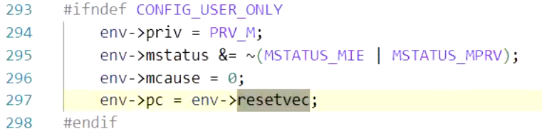

---

---

# lab0.5 实验报告

------

## Problem 1 RISC-V硬件加电后的几条指令在哪里?

##### 使用gdb调试QEMU模拟的RISCV计算机加电开始运行到执行应用程序的第一条指令（即跳转到0x80200000）

加电后，`RISC-V`会复位到地址 0x1000 处，我们从`qemu`的源码分析，为什么复位地址在 0x1000.

此处将 `reset vector （复位向量）` 的地址宏定义为 0x1000.

又将`reset vector`赋值给 `pc`，说明开机后的复位地址为 0x1000.

此处会执行5条汇编指令：

> 第一条指令：`auipc t0,0x0`
>
> 功能：将立即数（此处指 0x0）扩展到32位并加到当前指令地址的高 20 位上，并将结果存储在寄存器t0中。此时 t0 的值是0x1000.

> 第二条指令：`addi a1,t0,32`
>
> 功能：它将寄存器 `t0` 中的值和立即数（此处指 32）相加，并把结果存储在寄存器 `a1` 中。此时 `a1` 的值是0x1020.

> 第三条指令：`csrr a0,mhartid`
>
> 功能：用于读取控制和状态寄存器（`CSR`）中的 `mhartid` 寄存器的值，并将结果存储在寄存器 `a0` 中。`mhartid` 寄存器通常包含处理器的硬件线程 `ID`。此时 `a0` 的值为 0.

> 第四条指令：`ld t0,24(t0)`
>
> 功能：将地址为 t0 加上偏移量 24 的内存内容加载到目标寄存器 t0 中。此时 t0 的值是0x80000000.

> 第五条指令：`jr t0`
>
> 功能：将寄存器 t0 中存储的值作为跳转目标地址，并跳转到该地址。此时完成了地址转换。

这段代码完成了将 `PC` 寄存器跳转到 0x80000000 处。0x80000000 处通过 `QEMU` 自带的 `bootloader--OpenSBI` 固件，将两个文件被加载到 `QEMU` 的物理内存中：即作为 `bootloader` 的 `OpenSBI.bin` 被加载到物理内存以物理地址 0x80000000 开头的区域上，同时内核镜像 `os.bin` 被加载到以物理地址 0x80200000 开头的区域上。

运行完毕之后，`QEMU`窗口如下：

当计算机的中央处理单元（`CPU`）开始执行操作系统内核的第一条指令时，控制权会传递给内核，这标志着<u>**操作系统的启动和初始化过程的开始**</u>。内核接管计算机的控制后，它会负责进一步的系统初始化、硬件管理、进程调度以及为用户应用程序提供服务。

**链接脚本**（`Linker Script`）是一种配置文件，用于指导编译器如何将程序的不同部分（如源代码、库文件等）组合成可执行文件或可加载的二进制文件。它在编译和链接过程中起到关键作用，确保代码和数据正确地组合在一起，并分配到正确的内存地址。如果不提供链接脚本，`ld` 会使用默认的一个链接脚本，这个默认的链接脚本适合链接出一个能在现有操作系统下运行的应用程序，但是并不适合链接一个**操作系统内核**。

在本实验中，我们的链接脚本为 `kernel.ld` 文件，在此文件里我们定义了程序入口点 `kern_entry`，我们在 `kern/init/entry.S` 编写一段汇编代码, 作为整个内核的入口点，同时需要定义 `kern_entry` 为全局符号，使其可以被其他部分的代码顺利调用。

> `.globl kern_entry`

`kern_entry` 包含以下两条指令：

> `la sp,bootstacktop`
>
> 功能：将栈指针寄存器（Stack Pointer，用`sp`表示）的值设置为 `bootstacktop` 的地址，以**初始化栈指针**。

> `tail kern_init`
>
> 功能：这是一个**尾递归调用**，它调用了一个名为 `kern_init` 的函数。在尾递归调用中，调用发生在函数的最后，没有需要保存的当前函数状态，因此在调用结束后，程序不会返回到当前函数，从而避免了栈的过多使用。

实际上，上述入口点的作用是分配好内核栈，然后跳转到`kern_init`，我们在 `kern/init/init.c` 编写函数 `kern_init`, 作为“真正的”内核入口点。实验要求它能在命令行进行格式化输出。

现在，正式开始内核初始化，首先执行 `memset` 函数，初始化内存区域；然后，格式化输出 `(THU.CST) os is loading ...` 语句，运行界面如下所示；最后，程序执行下一条指令，系统一直跳转自身地址，进入死循环。

------

## Problem 2 完成了哪些功能？

1. **加电**（ `Power-On` ）：计算机系统被加电，开始供电。
2. **复位**（ `Reset` ）：在硬件上，计算机的处理器（ `CPU` ）通常会处于复位状态。在复位状态下，`CPU` 的程序计数器（PC）被设置为一个特定的复位地址。
3. **内存初始化**：比如本实验中执行 `memset` 函数时，对内存进行初始化，将内存区域的字节清零。
4. **引导启动加载**： `BootLoader` 将操作系统加载到内存中并启动它，比如本实验中 `QEMU` 将 `os.bin` 内核镜像加载到相应物理地址。

5. **跳转到程序入口点**：硬件通过执行跳转指令，将控制权转移到应用程序的入口点（本实验为 0x80200000 ）继续执行。

## 本实验中的重要知识点

1. **进程管理：**

   ·**上电复位（Power-On Reset）**：当 `RISC-V` 处理器首次上电时，会执行一个硬件复位过程，将所有内部寄存器和状态清零，确保处于一个已知的初始状态。

   ·**处理器初始化**：在复位后，处理器会执行一系列内部初始化操作，这包括初始化寄存器、缓存和其他控制单元。

   ·**引导程序加载**：处理器加载引导程序，用于引导操作系统或其他应用程序。引导程序通常存储在一个已知的内存地址上。

   ·**引导程序执行**：一旦引导程序被加载到内存中，处理器会跳转到引导程序的入口点并开始执行。引导程序的任务是初始化系统硬件、加载操作系统内核或其他关键组件，并最终将控制权交给操作系统。

   ·**操作系统初始化**：操作系统初始化过程包括设置中断处理、内存管理、进程管理和其他系统资源的初始化。一旦操作系统准备就绪，它将开始接受和管理用户进程的请求。

   ·**用户程序执行**：一旦操作系统初始化完成，它将开始执行用户程序。用户程序可以通过系统调用请求操作系统提供的服务，并在处理器上运行。

2. **上下文切换：**

   它允许处理器从一个正在运行的进程（或线程）切换到另一个。上下文切换涉及保存当前进程的状态，加载新进程的状态，并确保新进程可以继续执行，而不会丢失其先前的状态。

3. **内存管理：**

​		在引导过程中，操作系统需要初始化物理内存、虚拟内存，为进程分配和释放内存。

# LAB1实验报告

## Problem 1：理解内核启动中的程序入口操作

#### 阅读 kern/init/entry.S 内容代码，结合操作系统内核启动流程，说明指令 la sp, bootstacktop 完成了什么操作，目的是什么？tail kern_init 完成了什么操作，目的是什么？

- la的目的是将栈指针(sp)设置为bootstacktop的地址.

  sp 寄存器用于指示栈的顶部，即栈的最高地址

  这条指令确保栈操作不会越界，以便在内核初始化时使用，可以确保内核有足够的栈空间来运行，并且可以正确地处理中断、异常和函数调用等。

- tail 是一个汇编指令，它的作用是将程序的控制权转移到指定的函数并且不保留当前函数的调用信息。

  kern_init 是内核初始化的入口函数，这是操作系统启动时的第一个用户代码。

  tail kern_init是一个尾调用，当执行 tail kern_init 时，它会将程序的控制权转移到 kern_init 函数的开头，并将当前函数的栈帧替换为kern_init函数的栈帧，实现启动内核初始化过程。在kern_init 中，操作系统将完成一系列初始化任务，如初始化内存管理、文件系统、进程管理等。这个函数的完成标志着操作系统的启动。

- 综上所述，la sp, bootstacktop 用于设置正确的栈指针，以确保内核在初始化期间有足够的栈空间。而 tail kern_init 用于启动内核初始化过程，将控制权转移到内核的入口函数 kern_init，以便执行初始化任务。这两个操作是操作系统启动过程中的关键步骤。

## Problem 2：**完善中断处理**

#### 请编程完善 trap.c 中的中断处理函数 trap，在对时钟中断进行处理的部分填写 kern/trap/trap.c 函数中处理时钟中断的部分，使操作系统每遇到 100 次时钟中断后，调用 print_ticks 子程序，向屏幕上打印一行文字”100 ticks”，在打印完 10 行后调用 sbi.h 中的 shut_down() 函数关机。

- 完善的代码部分：

  

- 运行结果图：

  

- 说明：

  - 调用clock_set_next_event()函数设置下次时钟中断，并ticks+1；
  - 当ticks数量达100时，输出“100 ticks”表示触发了100次时钟中断，同时调用print_ticks()函数打印ticks值；
  - 当ticks为10（即不重置状态下的整十次时），调用关机函数（sbi_shutdown()）关机
  - 在异常处理函数中，trap_dispatch() 函数中根据异常原因来调用相应的异常处理函数或中断处理函数。

- 与lab1_answer对比分析：

  - 答案代码中，在ticks+1后都会与TICK_NUM进行取余计算判断，若取余为0，则调用print_ticks()函数打印ticks值
  - 本人答案，需调用两次函数，增加额外的关机函数的调用行为，中断处理较为复杂

## Challenge 1：描述与理解中断流程

#### 描述 ucore 中处理中断异常的流程（从异常的产生开始），其中 mov a0，sp 的目的是什么？SAVE_ALL中寄寄存器保存在栈中的位置是什么确定的？对于任何中断，__alltraps 中都需要保存所有寄存器吗？请说明理由。

- ucore中断异常处理流程如下：
  - 当发生中断或异常时，CPU会自动将当前的程序状态（包括程序计数器PC和其他寄存器）保存到内核栈中，以便在中断处理程序执行完毕后恢复现场。
  - 接着，CPU会跳转到相应的中断处理程序入口地址，处理器类型会根据异常或中断的跳到相应的异常处理程序的入口点，并根据异常号进行区分trapentry.S开始执行中断处理程序。
  - 在中断处理程序中，首先需要保存当前的现场，包括所有寄存器的值和栈指针SP的值。这些值会被保存到内核栈中。
  - 然后，需要根据具体的中断类型进行相应的处理。对于时钟中断、系统调用等常见的中断类型，ucore提供了相应的处理函数来完成具体的操作。
  - 最后，在中断处理程序执行完毕后，需要使用之前保存的场景来恢复程序的执行环境，包括所有寄存器的值和栈指针SP的值。

- mov语句的目的是将栈顶指针赋值给a0寄存器，作为trap函数的参数，以便下一步对中断的处理
- SAVE_ALL 中将所有寄存器的值保存到内核栈中的位置是由trapframe结构体定义决定的。
- 对于任何中断，_alltraps函数都需要保存所有寄存器。这是因为在ucore中，所有异常和中断都使用同一个入口点（即alltraps函数），因此需要保证在进入alltraps函数之前所有寄存器都被保存下来了。

## **Challenge2**：理解上下文切换机制

#### 在 trapentry.S 中汇编代码 csrw sscratch, sp；csrrw s0, sscratch, x0 实现了什么操作，目的是什么？save all里面保存了 stval scause 这些 csr，而在restore all 里面却不还原它们？那这样 store 的意义何在呢？

- csrw sscratch, sp 是将寄存器sp的值存储到系统寄存器sscratch中，目的是保存当前栈指针的值，以便在异常处理完成后能够正确地还原栈指针。
- csrrw s0, sscratch, x0 是将系统栈指针sscratch的值存储到寄存器s0中，并将寄存器x0的值存储到系统寄存器sscratch中，目的是保存当前sscratch的值，并将其设置为0，以便在发生递归异常时返回到正确的栈。
- 保存csr的目的是为了在异常处理的过程中能够获取异常的相关信息，以便进行适当的处理。
- 在restoreall中没有还原这些 csr 寄存器的原因是，在异常处理完成后，处理器会从异常处理流程中返回到原始的程序流程。这时，如果还原这些 csr 寄存器的值，会导致处理器再次进入异常状态，从而引发重复的异常处理逻辑，无法正常返回到原始的程序流程。
- store阶段保存这些 csr 寄存器的意义在于，在异常发生时能够获取异常的相关信息进行处理。

## Challenge3：完善异常中断

#### 编程完善在触发一条非法指令异常 mret 和，在 kern/trap/trap.c 的异常处理函数中捕获，并对其进行处理，简单输出异常类型和异常指令触发地址，即“Illegal instruction caught at 0x(地址)”，“ebreak caught at 0x（地址）”与“Exception type:Illegal instruction”，“Exception type : breakpoint”。

- 完善的代码部分：

  

- 同时还需要在initial.c文件中增加断点：

  

- 运行结果图:

  

